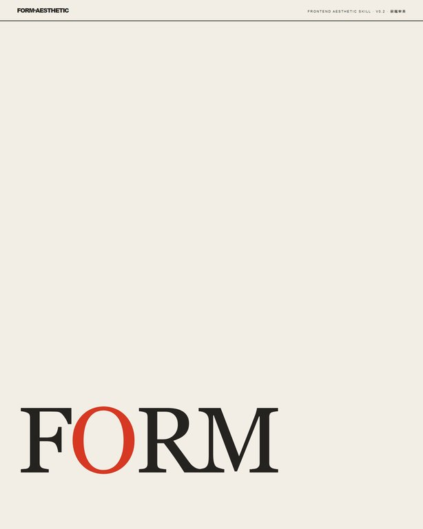
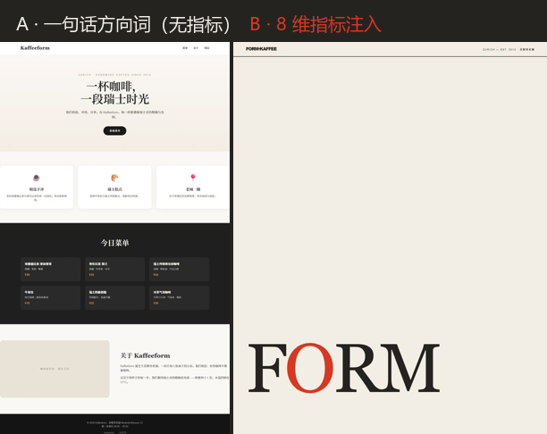
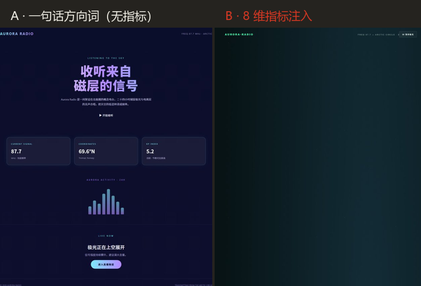
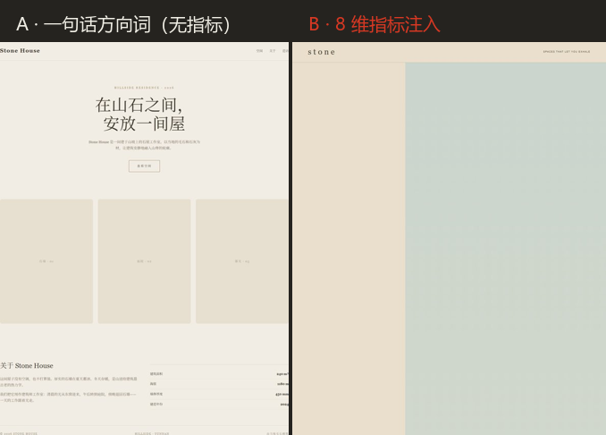

# frontend-aesthetic-skill

**把"万分之一审美"翻译成可执行约束** —— 一套 8 维 token 级指标约束网络，让普通模型脱离训练均值分布、做出高审美前端。

> A/B 验证三连证明：同一题材，一句话方向词的输出落入训练均值；注入 8 维指标后，输出完全脱离模板——差距是肉眼级的。

| 版本 | 形态 | 依赖 |
|---|---|---|
| v0.2 | SKILL.md 协议（可装载到任何 coding agent） | 零依赖 · 零构建 · 单文件 HTML |

## 点进来先看这个：Design 展示页

**这个页面本身由卡 1（Swiss 印刷风）的 8 维指标生成——是 Skill 的自证样本。**

- 在线浏览：[GitHub Pages 首页](https://texxxxture.github.io/frontend-aesthetic-skill/)（`index.html`）
- 仓库内源码：[design.html](design.html)



## A/B 验证：指标真的有效

三组实验均由普通模型（非旗舰级）执行，题材各不相同，只改一个变量：是否注入 8 维指标。

**ab1 · 卡1 Swiss 印刷风 · 咖啡馆首页**

| A · 一句话方向词（无指标） | B · 8 维指标注入 |
|---|---|
| 居中 hero + Playfair/Inter + 圆角卡片，通用模板 | 三栏不对称网格 + 巨型刊名 + 印刷色系，瑞士杂志气质 |



**ab2 · 卡2 氛围艺术风 · 极光电台概念页**

| A · 一句话方向词（无指标） | B · 8 维指标注入 |
|---|---|
| 蓝紫渐变 + Orbitron + 发光卡片（"极光=紫色"均值联想） | 近黑底 + 薄荷绿/蓝极光（禁紫）+ 玻璃拟态 + 14s 极光丝带 |



**ab3 · 卡3 建筑静默风 · 山间石屋概念页**

| A · 一句话方向词（无指标） | B · 8 维指标注入 |
|---|---|
| 导航 + 居中 hero + 图片占位符，模板结构 | 36/64 不对称 + 巨型衬线 + 纯 CSS 建筑插画 + 日光切换 |



**结论**：三张卡、三个题材，B 版全部脱离训练均值、A 版全部落入均值——**方向词不足是普遍现象，token 级约束才是杠杆**（与 Claude 官方美学 cookbook 结论一致，在普通模型上复现）。

## 核心机制：8 维约束网络

从高审美样本（GPT-6 Astra 生成）提取 token 级指标，固化为约束网络，生成时全覆盖注入——**不留一个让模型用训练先验填缝隙的口子**。

| # | 维度 | 约束内容（token 级） |
|---|---|---|
| 1 | 字体系统 | 白名单 + 角色三分（display/body/mono）+ 高对比配对；禁 Inter/Roboto 作 display |
| 2 | 色板角色表 | 背景/表面/边框/正文/强调五角色；主导色+锐利强调色；禁紫渐变白底 |
| 3 | 间距与网格 | 8pt 网格遵守；列比显式不对称；clamp 字号梯度 3x+ |
| 4 | 动效参数 | 时长/缓动显式（0.8-1.4s）；聚焦高影响时刻；尊重 reduced-motion |
| 5 | 背景质感 | ≥2 层质感；纯 CSS 绘制零外部资产；禁纯色平铺 |
| 6 | 风格方向词 | 一个词锁定气质；具象参考（印刷史/建筑/IDE 主题） |
| 7 | 结构与内容 | 页面区块显式清单；demo 数据必须"活"；虚构数据标 illustrative |
| 8 | 可访问与交付 | 语义 HTML/aria/可见焦点；输出完整 + 8 维自检清单 |

反均值禁区（A/B 验证反推）：禁 Playfair Display · 禁「主题→紫色」联想 · 禁 Orbitron · 禁无意义脉冲动画 · 禁图片占位敷衍。

## 预置风格预设卡

| 卡 | 风格 | 样本来源 | 特征 |
|---|---|---|---|
| 1 | **Swiss Print** 瑞士印刷风 | 002 FORM | 新闻纸色系 + sans/serif 高对比 + 不对称网格 + 规则线 |
| 2 | **Aurora Ambience** 氛围艺术风 | 001 Vesper | 近黑底 + 薄荷/蓝极光（禁紫）+ 玻璃拟态 + 巨型衬线 |
| 3 | **Architectural Stillness** 建筑静默风 | 004 Dune | 土色系 + 大留白 + 编辑式排版 + 纯 CSS 建筑插画 |

每张卡 = 完整 8 维 token 级指标（色板 hex、字号 clamp、字距、网格列比、动效参数、禁区）。

## 快速开始

```bash
# 1. 把 SKILL.md 挂载到 coding agent（system prompt / CLAUDE.md 附加）
# 2. 给一个风格方向词 + 内容需求，例如：
#    "用 Swiss 印刷风做一个咖啡馆首页"
# 3. Skill 展开 8 维约束注入生成 → 产物附 8 维自检清单
```

两档模式：

- **探索态**：只给风格方向词 + 3-4 个关键维度，其余放开——创意发散、选方向
- **收敛态**：8 维全锁死——定稿生成、交付

## 在线示例（A/B 产物，可直接打开）

| 实验 | B 版（指标注入） | A 版（无指标对照） |
|---|---|---|
| ab1 · Swiss 咖啡馆 | [ab1-cafe-constraints.html](examples/ab1-cafe-constraints.html) | [ab1-cafe-no-constraints.html](examples/ab1-cafe-no-constraints.html) |
| ab2 · 极光电台 | [ab2-radio-constraints.html](examples/ab2-radio-constraints.html) | [ab2-radio-no-constraints.html](examples/ab2-radio-no-constraints.html) |
| ab3 · 山间石屋 | [ab3-house-constraints.html](examples/ab3-house-constraints.html) | [ab3-house-no-constraints.html](examples/ab3-house-no-constraints.html) |

## 目录结构

```
frontend-aesthetic-skill/
├── README.md            # 本文件
├── index.html           # 设计展示页（Pages 首页，卡 1 生成的自证样本）
├── SKILL.md             # Skill 本体（8 维网络 + 预设卡 + 自检清单 + 两档模式）
├── design.html          # 设计展示页源码（与 index.html 同内容）
├── assets/              # README 对比图 + 展示页预览（scripts/make-compare.py 可复现）
├── examples/            # A/B 验证产物（6 个单文件 HTML）
└── scripts/             # 对比图合成脚本
```

## License

MIT（待补充版权声明；如需其他许可请提 issue）
